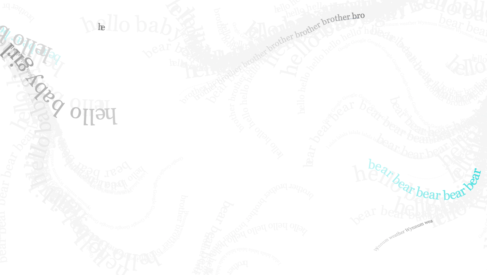
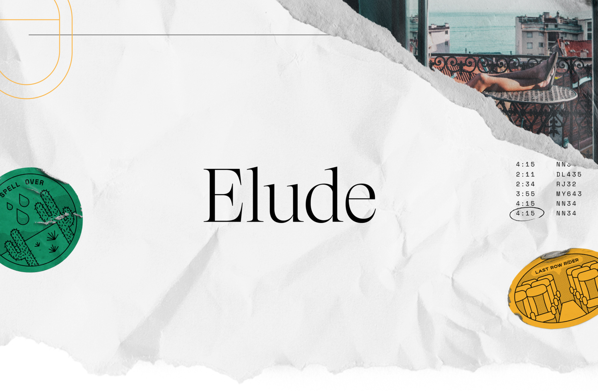
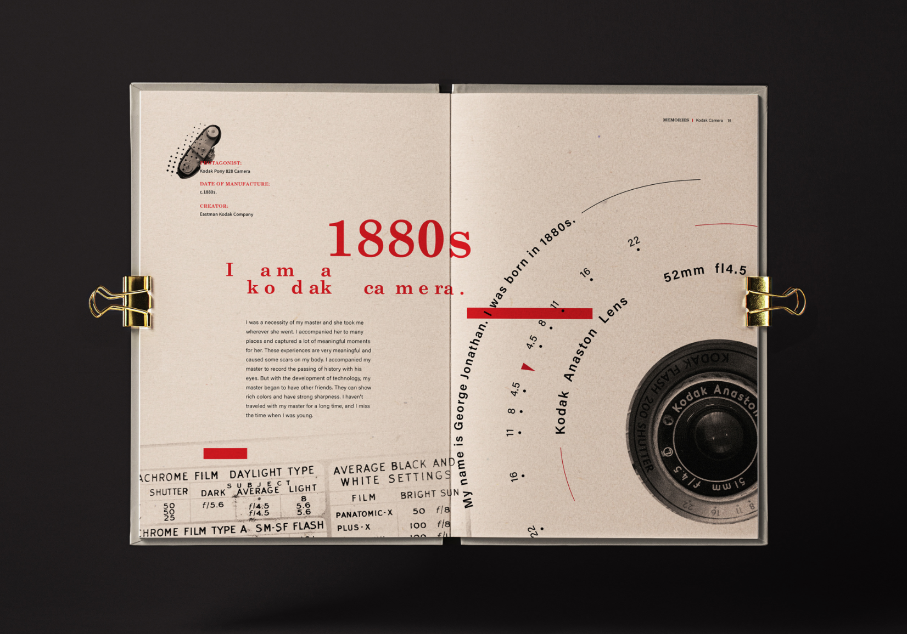
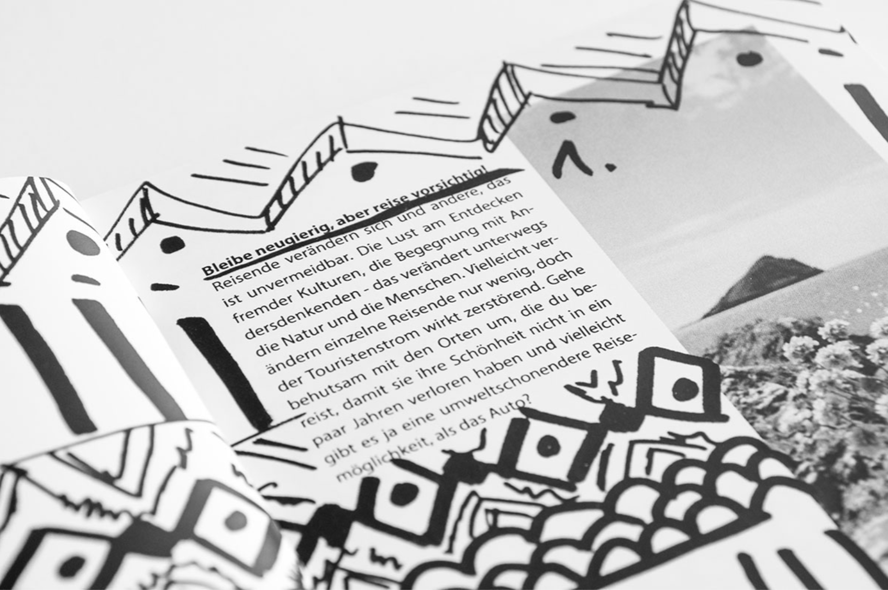
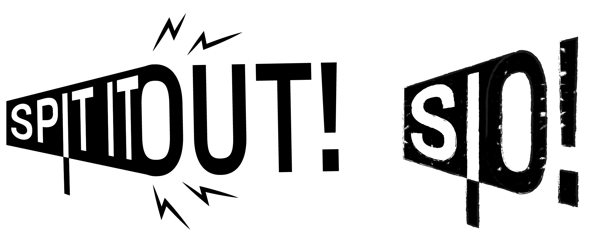
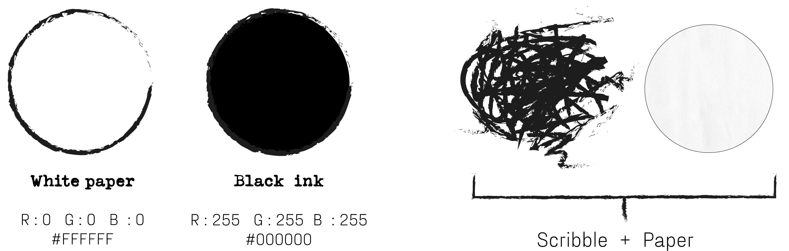
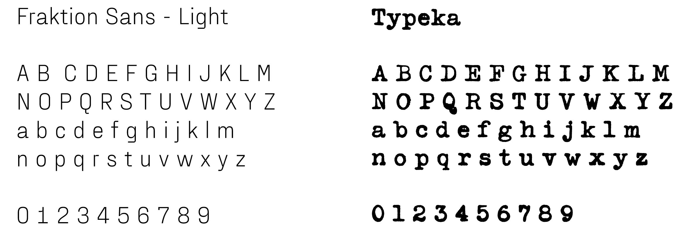
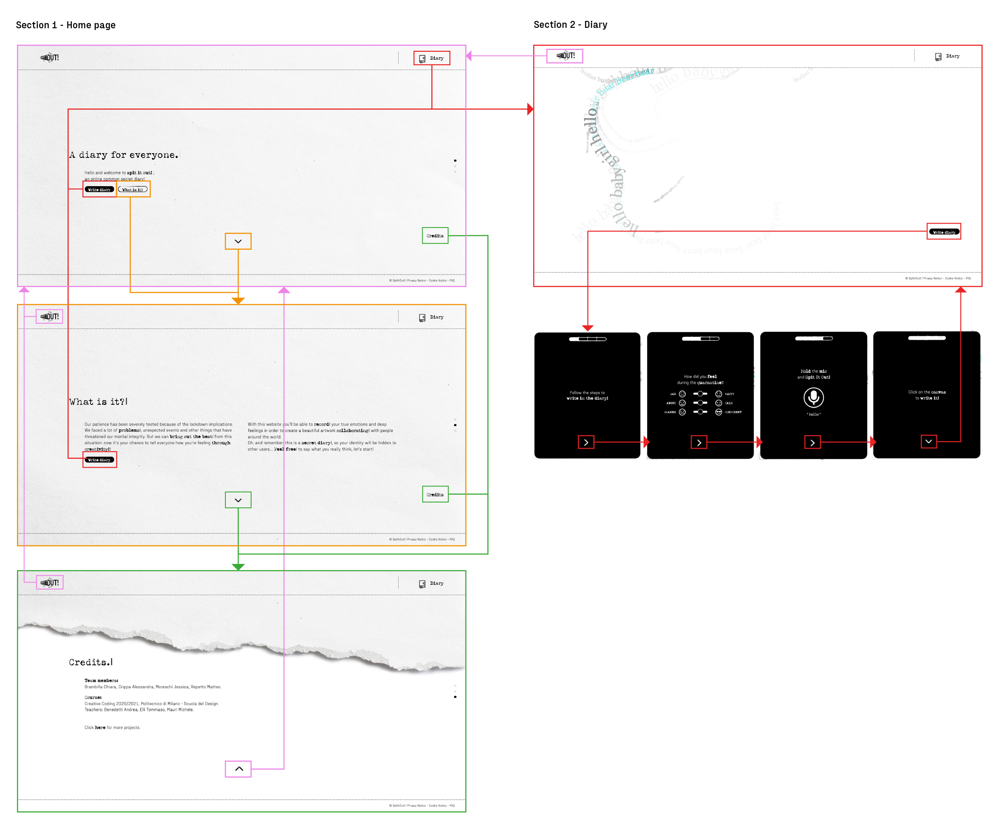
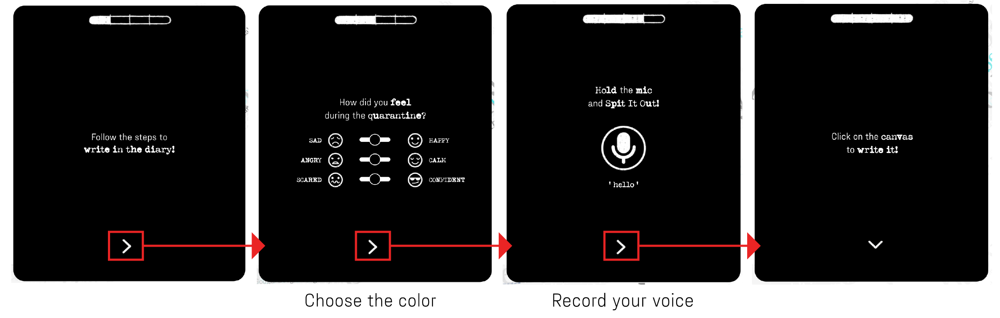

  

### Team members:
-  Brambilla Chiara
-  Crippa Alessandra
-  Moreschi Jessica
-  Repetto Matteo

### Course
[Creative Coding 2020/2021](https://drawwithcode.github.io/2020/) 
**Politecnico di Milano** - Scuola del Design 
**Faculty:** Michele Mauri, Andrea Benedetti, Tommaso Elli.

## Concept

Our patience has been severely tested because of the lockdown implications. We faced a lot
of different problems, unexpected events and other things that have threatened our mental
integrity. But we can bring out the best from this situation: Now it’s your chance to tell
everyone how you’re feeling… through creativity!

We present you... **Spit It Out!**
"Spit It Out" is phrase used to incentive to say what you are really thinking (in italian
can be translated as “sputa il rospo”, “sputalo fuori”).

It's is a common space that presents a diary as collaborative canvas: people will create 
a masterpiece of “**words traces**”. Step by step, the site will ask some questions to the user 
in order to generate a “river of words”. The final result it’s an artwork in which all 
the bad and good feelings dance together.

  

The aim of the project is giving voice to **deep feelings**, whatever they are. Together users 
will create an amazing and unpredictable artwork that will be shaped by the interaction of 
each other.

The entire experience is designed to work on computer and the mic is required.

## Design Challenges

In oreder to reflect an effective way the concept, a strong visual identity was necessary. A first part of the project was to research some inspirations and works with an hand drawn look and a sort of "diary mood". Infact, the site could be seen as a sort of public diary in which people can write their thougths without their identity being made public (no login or entering name is necessary). 

### Inspirations

The design and visual identity of this project was inspired by some exiting works (not only works about web and internet, but also about graphic design and typography). Here some links and images to discover them:
- [Paper textures](https://www.behance.net/gallery/105236297/Free-Download-8x-Detail-Paper-Texture-Collection?tracking_source=search_projects_recommended%7Cfree%20paper%20texture) by **Freeject.net Design**
- [Elude](https://www.behance.net/gallery/108994253/Elude) by **Herman Scheer**
- [Travel Bug](https://www.behance.net/gallery/38800427/Travel-Bug?tracking_source=search%7Cquotes) by **Lara Resch**
- [Memories Book Design](https://www.behance.net/gallery/106580687/Memories-Book-Design?tracking_source=search_projects_recommended%7Csecret%20book) by **Wanran Ding**

  
  
  

  

### Visual identity

**Logo**  
The logo is composed of two aspects: the title of the site (Spit It Out) and a stylized megaphone, who
represents the voice (a key element of the experience). Another characteristic is the texture applied
on the logo, who gives a hand drawn look.

 

There are also two alternatives of the logo, one without textures and one more "shortened" with only 
the initial letters S.I.O.

 

**Palette and textures**  
The color palette is very simple, composed by only two main colors (black and white) which resembles **ink**
and **paper**. The two textures too were selected to remember paper and ink.

 

**Fonts**  
The site uses two different fonts: the one called "**Fraktion Sans**" is used in standard texts, the other one called "**Typeka**", instead, is used in titles and underlined words (and it recalls typewriter's letters).

 

**Animations**  
The last but not the least is the large use of animations. They have been realized to be used as hover (so they can be triggered by passing the mouse on it) or as simple visual effects (such as the titles of the sections). All these animations follow the previous rules of the visual identity.

         
   
   
   

 

### UX

The UX have been designed to be simple and easy to understand for the users. The site presents two different main sections: one is "**Home page**" (reachable in any moment by pressing on the button with site's logo settled in the top-left of the page), in which you can find a welcome message, informations about what kind of site it is and the credits. The other one section is called "**Diary**" (reachable by pressing the diary in the top-right part of the site or the button "write in the diary" in the Home page) and it's where you can find the messages levead by other users around the world.

  

Users can insert their messages by pressing the button "Write in the diary" settled in the section Diary. By pressing it, a window will appear and step by step it will be explained how to insert a message:
- First it will be asked how they felt during the quarantine. Depending on the emotions chosen by moving the sliders, the stroke will have a certain **color** (each slider is releated to a specific channel f the colour method RGB).
- Second it will be asked to "spit it out" what thay are really feeling by holding with the mouse the mic icon. More high the **voice volume** is, more big the stroke of words will appear on the canvas.
- As third and final step it will be asked to click on the canvas of the site to see the final result.

  

## Code challenges

x. How save users's inputs. (firebase)
x. Recording users's speeches

## Credits
Fonts used:
[Fraktion Sans](https://www.behance.net/gallery/96836357/Fraktion-Sans-Typeface),
[Typeka](https://fonts.adobe.com/fonts/typeka)

Libraries: P5js, Firebase
